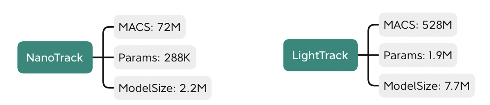

# NanoTrack 


- NanoTrack is a FCOS-style one-stage anchor-free object trakcing model which mainly referring to SiamBAN and LightTrack

- NanoTrack is a simple, lightweight and high speed tracking network, and it is very suitable for deployment on embedded or mobile devices. We provide [Android demo](https://github.com/HonglinChu/NanoTrack/tree/master/ncnn_android_nanotrack) and [MacOS demo](https://github.com/HonglinChu/NanoTrack/tree/master/ncnn_macos_nanotrack) based on ncnn inference framework. 
 

- We provide [PyTorch code](https://github.com/HonglinChu/SiamTrackers/NanoTrack). It is very friendly for training with much lower GPU memory cost than other models. We only use GOT-10k as tranining set, and it only takes two hours to train on GPU3090
    ```
    NanoTrack  VOT2018 EAO 0.301

    LightTrack VOT2018 EAO 0.42x
    ```
# NanoTrack for PyTorch  

- Build 
```
python  setup.py build_ext --inplace
```
- Prepare data 
```
1. cd xxx/xxx/NanoTrack 

2. mkdir data
Download [GOT-10k](https://pan.baidu.com/s/1L77mtmQI4pZfnEyfwz7QgA) password: 87d8 
Put your training data into data directory 

3. mkdir datasets
Download [VOT2018](https://pan.baidu.com/s/1MOWZ5lcxfF0wsgSuj5g4Yw) password: e5eh  
Put your testing data into datasets directory 

```
- Train
```
python ./bin/train.py 
```

- Test 
```
python ./bin/test.py 
```

- Eval
```
python ./bin/eval.py
```

```
checkpoint_e26.pth VOT2018  lr-0.38  pk-_0.15  win-_0.476
------------------------------------------------------------
|Tracker Name| Accuracy | Robustness | Lost Number |  EAO  |
------------------------------------------------------------
| nanotrack  |  0.550   |   0.356    |    76.0     | 0.301 |
------------------------------------------------------------
```
- Search params
```
python ./bin/hp_search.py 
```
- Calculate flops 
```
python cal_macs_params.py 
```

- Calculate speed
```
python cal_speed.py
```

- PyTorch to ONNX
```
python ./pytorch2onnx.py 
```

- ONNX to NCNN 
```
https://convertmodel.com/
```

# NanoTrack for MacOS 

[PC demo](https://www.bilibili.com/video/BV1HY4y1q7B6?spm_id_from=333.999.0.0)


- Modify your own CMakeList.txt

- Build (Apple M1 CPU) 

    ```
    $ sh make_macos_arm64.sh 
    ```

# NanoTrack for Android

[Android demo](https://www.bilibili.com/video/BV1eY4y1p7Cb?spm_id_from=333.999.0.0)

- Modify your own CMakeList.txt

- [Download](https://pan.baidu.com/s/1Yu1bpSKG-02fC5qekWXcLw)(password: 6cdd) OpenCV and NCNN libraries for Android 

# Reference  

https://github.com/Tencent/ncnn

https://github.com/hqucv/siamban

https://github.com/researchmm/LightTrack

https://github.com/Z-Xiong/LightTrack-ncnn

https://github.com/FeiGeChuanShu/ncnn_Android_LightTrack
