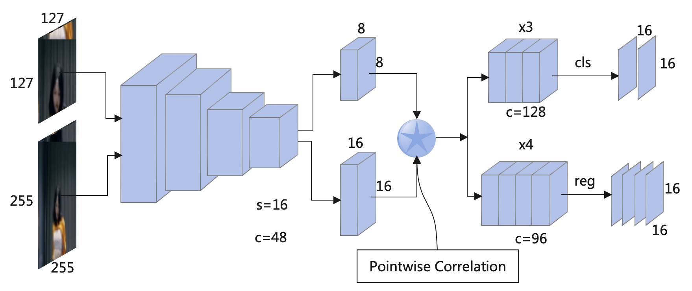

# NanoTrack 



- NanoTrack is a lightweight and high speed tracking network which mainly referring to SiamBAN and LightTrack. It is suitable for deployment on embedded or mobile devices. In fact, NanoTrackV2 can run at **> 200FPS** on Apple M1 CPU.

- Experiments show that NanoTrack has good performance on tracking datasets.

| Trackers            |   Backbone   | ModeSize | VOT2018 EAO | VOT2019 EAO | GOT-10k-Val AO | GOT-10k-Val SR | DTB70 Success | DTB70 Precision |
| :------------------ | :----------: | :------: | :---------: | :---------: | :------------: | :------------: | :-----------: | :-------------: |
| NanoTrackV1         | MobileNetV3  |  2.4MB   |    0.311    |    0.247    |     0.604      |     0.724      |     0.532     |      0.727      |
| NanoTrackV2         | MobileNetV3  |  2.0MB   |    0.352    |    0.270    |     0.680      |     0.817      |     0.584     |      0.753      |
| NanoTrackV3         | MobileNetV3  |  3.4MB   |    0.449    |    0.296    |     0.719      |     0.848      |     0.628     |      0.815      |
| CVPR2021 LightTrack | MobileNetV3  |  7.7MB   |    0.418    |    0.328    |      0.75      |     0.877      |     0.591     |      0.766      |
| WACV2022 SiamTPN    | ShuffleNetV2 |  62.2MB  |    0.191    |    0.209    |     0.728      |     0.865      |     0.572     |      0.728      |
| ICRA2021 SiamAPN    |   AlexNet    | 118.7MB  |    0.248    |    0.235    |     0.622      |     0.708      |     0.585     |      0.786      |
| IROS2021 SiamAPN++  |   AlexNet    |  187MB   |    0.268    |    0.234    |     0.635      |      0.73      |     0.594     |      0.791      |
- We provide [Android demo](https://github.com/HonglinChu/NanoTrack/tree/master/ncnn_android_nanotrack) and [MacOS demo](https://github.com/HonglinChu/NanoTrack/tree/master/ncnn_macos_nanotrack) based on ncnn inference framework. 

- We also provide [PyTorch code](https://github.com/HonglinChu/SiamTrackers/tree/master/NanoTrack). It is friendly for training with much lower GPU memory cost than other models. NanoTrack only uses GOT-10k dataset to train, which only takes two hours on GPU3090.

# PyTorch  

- Build 
```
python  setup.py build_ext --inplace
```
- Prepare data 
```
1. cd xxx/xxx/NanoTrack 

2. mkdir data
Download GOT-10k https://pan.baidu.com/s/10crE2uKR182fA93XRB3jyg password: 5ebm
How to crop GOT-10k https://pan.baidu.com/s/1ouqVMVAsLtXDWeanPYTkHw password: owlo
Put your training data into data directory 

3. mkdir datasets
Download VOT2018 https://pan.baidu.com/s/1MOWZ5lcxfF0wsgSuj5g4Yw password: e5eh  
Put your testing data into datasets directory 

```
- Select NanoTrackV1
```
file: ./nanotrack/models/head/__init__.py
    from nanotrack.models.head.ban_v1 import UPChannelBAN, DepthwiseBAN

file: ./models/config/configv1.yaml
    WINDOW_INFLUENCE: 0.462
    PENALTY_K: 0.148 
    LR: 0.390
```
- Select NanoTrackV2

```
file: ./nanotrack/models/head/__init__.py
    from nanotrack.models.head.ban_v2 import UPChannelBAN, DepthwiseBAN

file: ./models/config/configv2.yaml
    WINDOW_INFLUENCE: 0.490
    PENALTY_K: 0.150
    LR: 0.385
```

- Select NanoTrackV3

```
file: ./nanotrack/models/head/__init__.py
    from nanotrack.models.head.ban_v3 import UPChannelBAN, DepthwiseBAN

file: ./models/config/configv3.yaml
    WINDOW_INFLUENCE: 0.455
    PENALTY_K: 0.138
    LR: 0.348
```

- Train
```
python ./bin/train.py 
```

- Test 
```
python ./bin/test.py 
```

- Eval
```
python ./bin/eval.py
```

- Search params
```
python ./bin/hp_search.py 
```
```
python ./bin/eval.py \
--tracker_path ./hp_search_result \
--dataset VOT2018 \
--num 4 \
--tracker_name  'checkpoint*'
```

- Calculate flops 
```
python cal_macs_params.py 
```

- Calculate speed
```
python cal_speed.py
```

- PyTorch to ONNX
```
python ./pytorch2onnx.py 
```

- ONNX to NCNN 
```
https://convertmodel.com/
```

# MacOS 

[PC demo](https://www.bilibili.com/video/BV1HY4y1q7B6?spm_id_from=333.999.0.0)


- Modify CMakeList.txt

- Build (Apple M1 CPU) 

    ```
    $ sh make_macos_arm64.sh 
    ```

# Android

[Android demo](https://www.bilibili.com/video/BV1eY4y1p7Cb?spm_id_from=333.999.0.0)

- Modify CMakeList.txt

- [Download](https://pan.baidu.com/s/1Yu1bpSKG-02fC5qekWXcLw)(password: 6cdd) OpenCV and NCNN libraries for Android 
◊
# Reference  

- [LightTrack](https://github.com/researchmm/LightTrack)

- [SiamBAN](https://github.com/hqucv/siamban)

- [SiamTPN](https://github.com/RISC-NYUAD/SiamTPNTracker)

- [SiamAPN&SiamAPN++](https://github.com/vision4robotics/SiamAPN)
