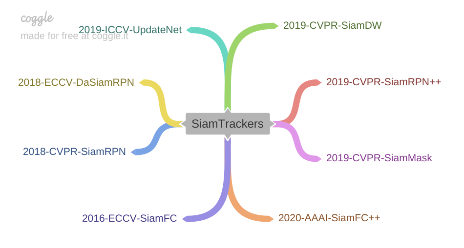
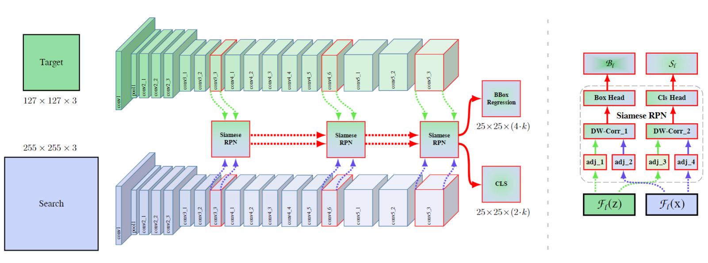
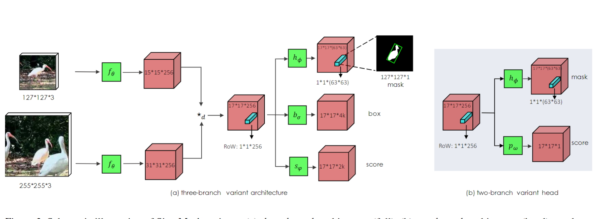

# SiamTrackers



# Description

  | Trackers     |  Debug   | Train   | Test  |  Evaluation |  Toolkit | GPU | Version |Upload |
   | :--------- | :--------: | :------: |:------:  |:------: |:------: |  :------: |  :------: | :------: | 
   | [Siamese](https://github.com/HonglinChu/SiamTrackers/tree/master/Siamese)    | ✔| ✔ |✔| ✔  |   | ✔|  | ✔|
   | [SiamFC](https://github.com/HonglinChu/SiamTrackers/tree/master/SiamFC)    | ✔ |  ✔|  ✔| ✔| got10k|✔|unofficial|✔|
   | [SiamRPN](https://github.com/HonglinChu/SiamTrackers/tree/master/SiamRPN)     | ✔ |  ✔|  ✔| ✔| got10k|  ✔|unofficial|✔|
   | [DaSiamRPN](https://github.com/HonglinChu/SiamTrackers/tree/master/DaSiamRPN)     | ✔ |  |  ✔| ✔| pysot| ✔| unofficial|✔|
   | [UpdateNet](https://github.com/HonglinChu/SiamTrackers/tree/master/UpdateNet)  | ✔ |  ✔|  ✔| ✔| pysot| ✔| unofficial|✔|
   | [SiamDW](https://github.com/HonglinChu/SiamTrackers/tree/master/SiamDW)      |  ✔ |  ✔|  ✔| ✔| -| ✔|official| |
   | [SiamRPN++](https://github.com/HonglinChu/SiamTrackers/tree/master/SiamRPN++)   |  ✔ |  ✔|  ✔| ✔| pysot| ✔|official|✔|
   | [SiamMask](https://github.com/HonglinChu/SiamTrackers/tree/master/SiamMask)    |  ✔ |  ✔|  ✔| ✔| pysot| ✔|official| |
   | [SiamFC++](https://github.com/HonglinChu/SiamTrackers/tree/master/SiamFC++)   | ✔ |  ✔|  ✔| ✔| pysot&got10k| ✔|official|✔|

[BiliBili](https://www.bilibili.com/video/BV1Y64y1T7qs/) Some of the codes that have not been uploaded have official links in the corresponding folders. 

- [Siamese](https://github.com/HonglinChu/SiamTrackers/tree/master/Siamese)

The implementation of simple face classification based on siamese network.


- [2016-ECCV-SiamFC](https://github.com/HonglinChu/SiamTrackers/tree/master/SiamFC)


Add GOT10K toolkit and optimize the interface. 
We use the VID data set for training . 
The testing results are slightly lower than the paper(without hyperparameter adjustment). 


- [2018-CVPR-SiamRPN](https://github.com/HonglinChu/SiamTrackers/tree/master/SiamRPN)


Add GOT10K toolkit and optimize the interface. 
We use YTB and VID  data sets for training. 
The testing results are slightly lower than the paper(without hyperparameter adjustment). 

- [2018-ECCV-DaSiamRPN](https://github.com/HonglinChu/SiamTrackers/tree/master/DaSiamRPN)

Add PYSOT toolkit and optimize the interface. 
You can  debug, train and test easily.  
The results of testing are consistent with the paper
Note that you shound have python3  environment.

- [2019-ICCV-UpdateNet](https://github.com/HonglinChu/SiamTrackers/tree/master/UpdateNet)   


Add PYSOT toolkit and optimize the interface. 

The model is sensitive to learning rate. 

Our results is higher than the original paper on VOT2018 dataset. EAO=0.403(Ours)  EAO=0.393(Paper)

- [2019-CVPR-SiamDW](https://github.com/HonglinChu/SiamTrackers/tree/master/SiamDW)

The paper mainly analyzed the impact of padding on the tracking network. 

- [2019-CVPR-SiamRPN++](https://github.com/HonglinChu/SiamTrackers/tree/master/SiamRPN++)


Support VScode single-step debugging.

Add test scripts for 4 drone datasets.

Change distributed multi-machine multi-GPU parallel to single-machine multi-GPU parallel.

Train SiamRPN++ AlexNet version using four datasets (training time is  3~4 days with 2 1080 GPUs ).

- [2019-CVPR-SiamMask](https://github.com/HonglinChu/SiamTrackers/tree/master/SiamMask)


Support VScode single-step debugging.

Support testing and training.

The results of my test are  inconsistent with the author's, please refer to my SiamMask branch.

- [2020-AAAI-SiamFC++](https://github.com/HonglinChu/SiamTrackers/tree/master/SiamFC++)


Support VScode single-step debugging.

Add test scripts for 4 drone datasets.

Use  GOT10K data set to retrain the AlexNet version, the training time is 15~20 hours (2 1080 GPUs).

# Experiment
- GPU NVIDIA 1080 8G  
- CPU Intel® Xeon(R) CPU E5-2650 v4 @ 2.20GHz × 24 
- CUDA 9.0
- Ubuntu 16.04  
- PyTorch 1.1.0
- Python 3.7.3
- Due to the limitation of computer configuration, i only choose some high speed  algorithms for training and testing on several small  tracking datasets

|   Trackers|       | SiamFC   | DaSiamRPN   |DaSiamRPN | SiamRPN++ |SiamRPN|SiamFC++ |
|:---------:|:-----:|:--------:| :------:    |:------:  |:------:   |:------: |:------:|
|           |       |           |            |         |         |       |        |
|  Backbone |   -    | AlexNet |  AlexNet(OTB/VOT)  |AlexNet(BIG)    | AlexNet(DW)    |AlexNet(UP)    |AlexNet|
|     FPS   |     |   85   |   >120         |   >120 |    >120      |    >120       |    >120     |
|           |       |           |            |         |         |       |        |
| OTB100    |  AUC   |  0.570    |   0.655   |  0.646   |   0.648  | 0.637  | **0.680**    |
|           |  DP   |   0.767    |   0.880   |  0.859   |  0.853   |0.851   | **0.884**   |
|           |     |           |            |         |         |       |        |
| UAV123    |  AUC  |   0.504    |   0.586   |  0.604   |  0.578   |0.527   |  **0.623**    |
|           |  DP   |    0.702   |   0.796   | **0.801**    |  0.769   |0.748   |  0.781   |
|           |     |           |            |         |         |       |        |
| UAV20L    |  AUC  |  0.410     |         |   0.524  |  **0.530**   |0.454   |  0.516  |
|           |  DP   |   0.566    |         | **0.691**   |  0.695   |0.617   |  0.613   |
|           |     |           |            |         |         |       |        |
| DTB70     |  AUC  |    0.487   |          |  0.554|   0.588  |        | **0.639**   |
|           |  DP   |    0.735   |         |   0.766|   0.797  |        |  **0.826**   |
|           |       |           |            |         |         |       |        |
| UAVDT     |  AUC  |   0.451 |           |  0.593  |  0.566   |       |  **0.632**    |
|           | DP    |   0.710 |           |  0.836  |  0.793   |       |   **0.846**   |
|           |     |           |            |         |         |       |        |
| VisDrone  | AUC   |    0.510|           |   0.547 |  0.572   |       |  **0.588**    |
|           |  DP   |    0.698|           |   0.722 |   0.764  |       |  **0.784**    |
|           |     |           |            |         |         |       |        |
| VOT2016   |  A  |   0.538    |  0.61      |  0.625   |  0.618   |0.56    |  **0.626**    |
|           | R     |    0.424   |  0.22      |  0.224   |  0.238   |0.26    |   **0.144**   |
|           | E     |    0.262   |  0.411     |  0.439   |  0.393   | 0.344  |  **0.460**    |
|           |Lost   |    91      |           |  48      |  51      |       |    31  |
|           |     |           |            |         |         |       |        |
| VOT2018   | A     |     0.501  |   0.56     |  **0.586**   | 0.576    |0.49    | 0.577   |
|           |  R    |    0.534   |   0.34     |  0.276   |  0.290   |0.46    | **0.183**   |
|           | E     |    0.223   |   0.326    | 0.383    |  0.352   |0.244   | **0.385**   |
|           | Lost  |   114      |           |  59      |   62       |       |   39     |

# Dataset

- **UAV123** [BaiduYun](https://pan.baidu.com/s/1AhNnfjF4fZe14sUFefU3iA) password: 2iq4

- **VOT2018**  [BaiduYun](https://pan.baidu.com/s/1MOWZ5lcxfF0wsgSuj5g4Yw) password: e5eh

- **VisDrone2019**  [BaiduYun](https://pan.baidu.com/s/1Y6ubKHuYX65mK_iDVSfKPQ) password: yxb6 

- **OTB2015**  [BaiduYun](https://pan.baidu.com/s/1ZjKgRMYSHfR_w3Z7iQEkYA) password: t5i1

- **DTB70**  [BaiduYun](https://pan.baidu.com/s/1kfHrArw0aVhGPSM91WHomw) password: e7qm

- **ILSVRC2015 VID** [BaiDuYun](https://pan.baidu.com/s/1CXWgpAG4CYpk-WnaUY5mAQ) password: uqzj 

- **NFS** [BaiduYun](https://pan.baidu.com/s/1ei54oKNA05iBkoUwXPOB7g) password: vng1

- **GOT10k** [BaiduYun](https://pan.baidu.com/s/172oiQPA_Ky2iujcW5Irlow) password: uxds

- **UAVDT** [BaiduYun](https://pan.baidu.com/s/1K8oo53mPYCxUFVMXIGLhVA) password: keva

- **YTB-VOS** [BaiduYun](https://pan.baidu.com/s/1WMB0q9GJson75QBFVfeH5A) password: sf1m 

- **YTB-Crop511** [BaiduYun](https://pan.baidu.com/s/112zLS_02-Z2ouKGbnPlTjw) password: ebq1 （used in siamrpn++ and siammask）

- **TColor128** [BaiduYun](https://pan.baidu.com/s/1v4J6zWqZwj8fHi5eo5EJvQ) password: 26d4

- **DAVIS2017** [BaiduYun](https://pan.baidu.com/s/1JTsumpnkWotEJQE7KQmh6A) password: c9qp

- **YTB&VID**  [BaiduYun](https://pan.baidu.com/s/1gF8PSZDzw-7EAVrdYHQwsA) password: 6vkz (used in siamrpn)

- **TrackingNet** [BaiduYun](https://pan.baidu.com/s/1PXSRAqcw-KMfBIJYUtI4Aw) password: nkb9  (Note that this link is provided by SiamFC++ author)

# Toolkit
### Matlab version

- OTB2013/2015  [Github](https://github.com/HonglinChu/visual_tracker_benchmark)

- UAV123 [BaiduYun](https://pan.baidu.com/s/1wTahpGHIgS5gN0T3fqOjsg) password: zx9c

- UAV20L [BaiduYun](https://pan.baidu.com/s/1oCe8vVMt6uY2xk17psOsyA) password: s1y8

- UAVDT [BaiduYun](https://pan.baidu.com/s/1H80x6i2LlGpQL9Nix0bb7Q) password: f7ad

- VisDrone2019 [BaiduYun](https://pan.baidu.com/s/1LCWgBMW1StWTW6SrWf5d3w) password: 28lb

- TC128 [BaiduYun](https://pan.baidu.com/s/16dAEKDH41TbozV72KsfptQ) password: 7uif

- VOT2016 [BaiduYun](https://pan.baidu.com/s/1JGo_81vWSe4AHE52CEYl3A) password: 4orc

- VOT2018 [BaiduYun](https://pan.baidu.com/s/1G_uodEE5vTxwkGLqTtILwA) password: l5y4

### Python version

- pysot-toolkit：OTB, VOT, UAV, NfS, LaSOT are supported.[BaiduYun](https://pan.baidu.com/s/1H2Hc4VXsWahgNjDZJP8jaA) password: 2t2q

- got10k-toolkit：GOT-10k, OTB, VOT, UAV, TColor, DTB, NfS, LaSOT and TrackingNet are supported.[BaiduYun](https://pan.baidu.com/s/1OS80_OPtZoo0ZFKzfCOFzg) password: vsar

# Papers

[BaiduYun](https://pan.baidu.com/s/1nyXMesdAUHzdSQkM88AvWQ) password: fukj

 # :star2:Welcome To Join Us! :star2:

You can scan the following QR code to join the SiamTrackers group. Let's communicate and make progress together! 


# Reference
```
[1] SiamFC

Bertinetto L, Valmadre J, Henriques J F, et al. Fully-convolutional siamese networks for object tracking.European conference on computer vision. Springer, Cham, 2016: 850-865.
   
[2] SiamRPN

Li B, Yan J, Wu W, et al. High performance visual tracking with siamese region proposal network.Proceedings of the IEEE Conference on Computer Vision and Pattern Recognition. 2018: 8971-8980.

[3] DaSiamRPN

Zhu Z, Wang Q, Li B, et al. Distractor-aware siamese networks for visual object tracking.Proceedings of the European Conference on Computer Vision (ECCV). 2018: 101-117.

[4] UpdateNet

Zhang L, Gonzalez-Garcia A, Weijer J, et al. Learning the Model Update for Siamese Trackers. Proceedings of the IEEE International Conference on Computer Vision. 2019: 4010-4019.
   
[5] SiamDW

Zhang Z, Peng H. Deeper and wider siamese networks for real-time visual tracking. Proceedings of the IEEE Conference on Computer Vision and Pattern Recognition. 2019: 4591-4600.

[6] SiamRPN++

Li B, Wu W, Wang Q, et al. Siamrpn++: Evolution of siamese visual tracking with very deep networks.Proceedings of the IEEE Conference on Computer Vision and Pattern Recognition. 2019: 4282-4291.

[7] SiamMask

Wang Q, Zhang L, Bertinetto L, et al. Fast online object tracking and segmentation: A unifying approach. Proceedings of the IEEE conference on computer vision and pattern recognition. 2019: 1328-1338.
   
[8] SiamFC++

Xu Y, Wang Z, Li Z, et al. SiamFC++: Towards Robust and Accurate Visual Tracking with Target Estimation Guidelines. arXiv preprint arXiv:1911.06188, 2019.
```
