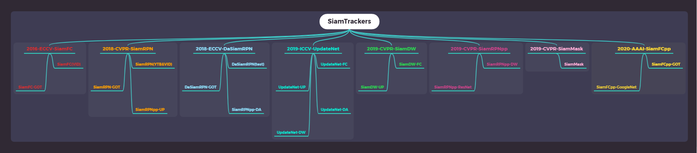
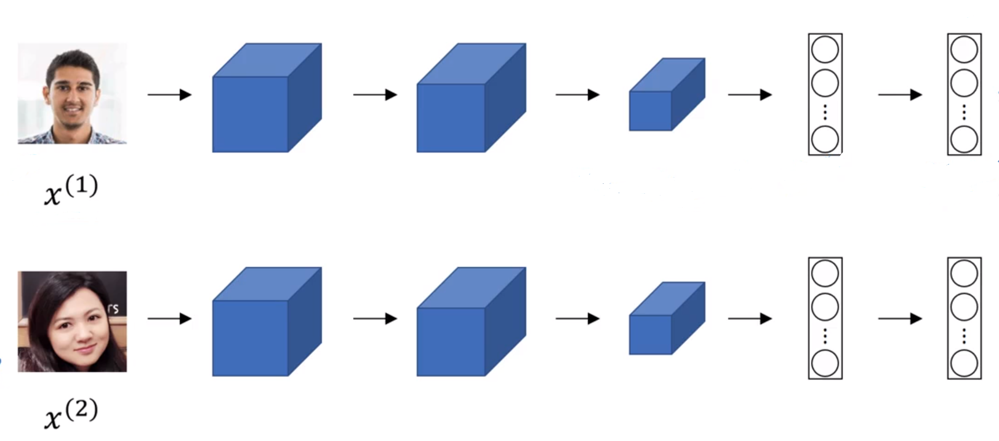
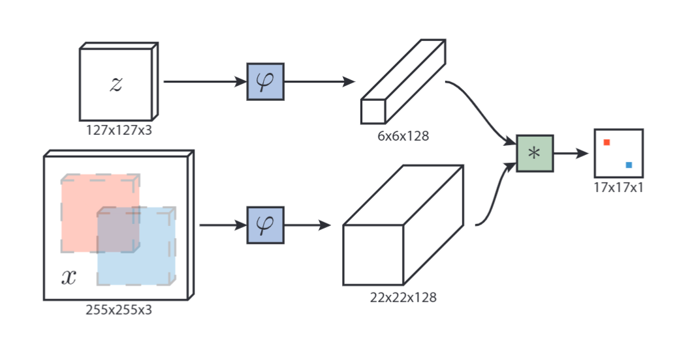
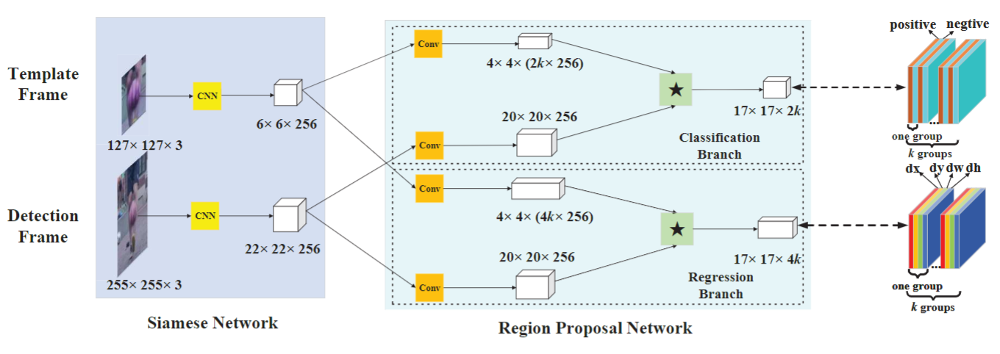
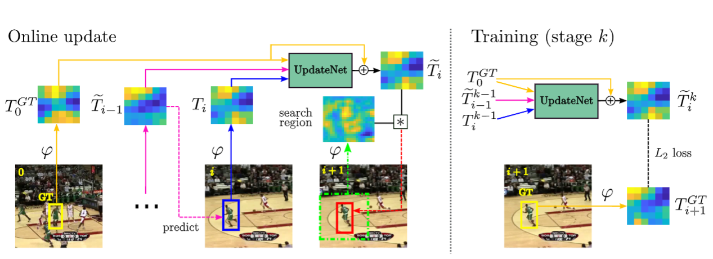
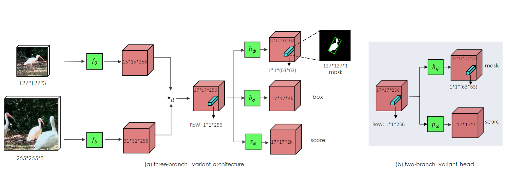

# [SiamTrackers](https://www.bilibili.com/video/BV1pt4y1e7PY/?spm_id_from=333.788.recommend_more_video.8) 



# Description

| Year | Conf |               Trackers               | Debug | Train | Test |      |      | Data | Set  |      |       |   Toolkit    |   Source   |
| :--- | :--- | :----------------------------------: | ----- | :---: | :--: | :--: | :--: | :--: | :--: | :--: | :---: | :----------: | :--------: |
|      |      |                                      |       |       |      | VID  | DET  | COCO | YTB  | GOT  | LaSOT |              |            |
| 2016 | ECCV |     SiamFC      | ✔     |   ✔   |  ✔   |  ✔   |      |      |      |      |       |    got10k    | unofficial |
|      |      | SiamFC      | ✔     |   ✔   |  ✔   |      |      |      |      |  ✔   |       |    got10k    | unofficial |
|      |      |                                      |       |       |      |      |      |      |      |      |       |              |            |
| 2018 | CVPR |    SiamRPN   | ✔     |   ✔   |  ✔   |  ✔   |      |      |  ✔   |      |       |    got10k    | unofficial |
|      |      | SiamRPN | ✔     |   ✔   |  ✔   |      |      |      |      |  ✔   |       |    got10k    | unofficial |
|      |      |                                      |       |       |      |      |      |      |      |      |       |              |            |
| 2018 | ECCV |      DaSiamRPN     | ✔     |       |  ✔   | ✔ | ✔ | ✔ | ✔ |      |       |    pysot     | official |
|      |      |      DaSiamRPN  |   ✔   |   ✔    |   ✔   |      |      |      |      |  ✔    |       |  pysot | unofficial   |
|      |      |                                      |       |       |      |      |      |      |      |      |       |              |            |
| 2019 | ICCV |     UpdateNet(FC)     | ✔     |   ✔   |  ✔   |      |      |      |      |      |   ✔   |    pysot     | unofficial |
|  |  | UpdateNet(UP) | ✔ | ✔ | ✔ | | | | | | ✔ | pysot | unofficial |
|  |  | UpdateNet(DA) | ✔ | ✔ | ✔ | | | | | | ✔ | pysot | official |
|  |  | UpdateNet(DW) | ✔ | ✔ | ✔ | | | | | | ✔ | pysot | unofficial |
|      |      |                                      |       |       |      |      |      |      |      |      |       |              |            |
| 2019 | CVPR |       SiamDW(FC)       | ✔     |   ✔   |  ✔   |      |      |      |      |      |   ✔   | got10k |  unofficial  |
|  |  | SiamDW(UP) | ✔ | ✔ | ✔ |  |  |  |  |  | ✔ | got10k | unofficial |
|      |      |                                      |       |       |      |      |      |      |      |      |       |              |            |
| 2019 | CVPR | SiamRPNpp(DW) | ✔     |   ✔   |  ✔   |  ✔   |  ✔   |  ✔   |  ✔   |      |       |    pysot     | official |
|      |      |SiamRPNpp(DW)| ✔     |   ✔   |  ✔   |      |      |      |      |  ✔   |       |    pysot     |  unofficial|
| | |SiamRPNpp(UP)| ✔ | ✔ | ✔ | | | | | ✔ | | pysot | unofficial |
| | |SiamRPNpp(DA)| ✔ | ✔ | ✔ | | | | | ✔ | | pysot | unofficial |
| | |SiamRPNpp(ResNet)| ✔ | ✔ | ✔ | ✔ | ✔ | ✔ | ✔ |  | | pysot | official |
|      |      |                                      |       |       |      |      |      |      |      |      |       |              |            |
| 2019 | CVPR |       SiamMask      | ✔     |   ✔   |  ✔   |  ✔   |  ✔   |  ✔   |  ✔   |      |       |    pysot     |  official  |
|      |      |                                      |       |       |      |      |      |      |      |      |       |              |            |
| 2020 | AAAI |  SiamFCpp | ✔     |   ✔   |  ✔   |  ✔   |  ✔   |  ✔   |  ✔   |  ✔   |   ✔   | pysot&got10k | official |
|      |      | SiamFCpp | ✔     |   ✔   |  ✔   |      |      |      |      |  ✔   |       | pysot&got10k | unofficial |
| | | SiamFCpp(GoogleNet) | ✔ | ✔ | ✔ | ✔ | ✔ | ✔ | ✔ | ✔ | ✔ | pysot&got10k | official |

- [BiliBili](https://www.bilibili.com/video/BV1pt4y1e7PY/?spm_id_from=333.788.recommend_more_video.8) 

- [SiamFace](./1-SiamFace)

```
The implementation of simple face classification based on siamese network.
```

- [2016-ECCV-SiamFC](./2-SiamFC)

```
Add GOT10K toolkit and optimize the interface. 

We use the VID data set for training . 

The testing results are slightly lower than the paper(without hyperparameter adjustment). 
```

- [2018-CVPR-SiamRPN](./3-SiamRPN)

```
Add GOT10K toolkit and optimize the interface. 

We use YTB and VID  data sets for training. 

The testing results are slightly lower than the paper(without hyperparameter adjustment). 
```
- [2018-ECCV-DaSiamRPN](./4-DaSiamRPN)
```
Add PYSOT toolkit and optimize the interface. 

You can  debug, train and test easily.  

The results of testing are consistent with the paper.

Note that you shound have python3  environment.
```
- [2019-ICCV-UpdateNet](./5-UpdateNet)   

```
Add PYSOT toolkit and optimize the interface. 

The model is sensitive to learning rate. 

Our results is higher than the original paper on VOT2018 dataset. EAO=0.403(Ours)  EAO=0.393(Paper)
```
- [2019-CVPR-SiamDW](./6-SiamDW)
```
The paper mainly analyzed the impact of padding on the tracking network. 
```
- [2019-CVPR-SiamRPNpp](./7-SiamRPNpp)

```
Support VScode single-step debugging.

Add test scripts for 4 drone datasets.

Change distributed multi-machine multi-GPU parallel to single-machine multi-GPU parallel.

Train SiamRPNpp AlexNet version using four datasets (training time is  3~4 days with 2 1080 GPUs ).
```
- [2019-CVPR-SiamMask](./8-SiamMask)

```
Support VScode single-step debugging.

Support testing and training.

The results of my test are  inconsistent with the author's, please refer to my SiamMask branch.
```
- [2020-AAAI-SiamFCpp](./9-SiamFCpp)

```
Support VScode single-step debugging.

Add test scripts for 4 drone datasets.

Use  GOT10K data set to retrain the AlexNet version, the training time is 15~20 hours (2 1080 GPUs).
```
# Experiment

- [x] GPU NVIDIA 1080 8G x 2 
- [x] CPU Intel® Xeon(R) CPU E5-2650 v4 @ 2.20GHz × 24 
- [x] CUDA 9.0
- [x] Ubuntu 16.04  
- [x] PyTorch 1.1.0
- [x] Python 3.7.3

Due to the limitation of computer configuration, i only choose some high speed  algorithms for training and testing on several small  tracking datasets

|   Trackers|       | SiamFC   | SiamRPN | SiamRPN | DaSiamRPN |DaSiamRPN | SiamRPNpp | SiamRPNpp | SiamRPNpp | SiamRPNpp | SiamFCpp |SiamFCpp |
|:------------:|:-----:|:--------:   | :------:    |:------:  |:------: |:------:|:------:|:------:|:------:|:------:|:------:|:------:|
| Train Set |       | GOT | official | GOT | official | official | official | GOT | GOT | GOT | GOT | official |
|  Backbone |  | Group | AlexNet | AlexNet |  AlexNet  |    DA     | DW    | DW  | UP | DA | AlexNet |AlexNet|
|     FPS   |     |   85   |   >120   |   >120   |   >120        |   >120 |    >120      |    >120  |    >120  | >120  | >120 |    >120 |
|           |       |           |           |           |            |         |         |         |         |         |         |        |
| OTB100    |  AUC   |  0.589  | 0.637 | 0.603 |   0.655   |  0.646   |   0.648  |  0.623  |  0.619  |  0.634  |  0.629  | **0.680**    |
|           |  DP   |   0.794   | 0.851 | 0.820 |   0.880   |  0.859   |  0.853   |  0.837  |  0.823  |  0.846  |  0.830  | **0.884**   |
|           |     |           |           |           |            |         |         |         |         |         |         |        |
| UAV123    |  AUC  |   0.504    | 0.527 |  |   0.586   |  0.604   |  0.578   |     |     |     |     |  **0.623**    |
|           |  DP   |    0.702   | 0.748   |    |   0.796   | **0.801**    |  0.769   |     |     |     |     |  0.781   |
|           |     |           |           |           |            |         |         |         |         |         |         |        |
| UAV20L    |  AUC  |  0.410     | 0.454 |  |         |   0.524  |  **0.530**   |     |     |     |     |  0.516  |
|           |  DP   |   0.566    | 0.617 |  |         | **0.691**   |  0.695   |     |     |     |     |  0.613   |
|           |     |           |           |           |            |         |         |         |         |         |         |        |
| DTB70     |  AUC  |    0.487   |       |       |          |  0.554|   0.588  |     |     |     |     | **0.639**   |
|           |  DP   |    0.735   |       |       |         |   0.766|   0.797  |     |     |     |     |  **0.826**   |
|           |       |           |           |           |            |         |         |         |         |         |         |        |
| UAVDT     |  AUC  |   0.451 |    |    |           |  0.593  |  0.566   |     |     |     |     |  **0.632**    |
|           | DP    |   0.710 |    |    |           |  0.836  |  0.793   |     |     |     |     |   **0.846**   |
|           |     |           |           |           |            |         |         |         |         |         |         |        |
| VisDrone-Train  | AUC   |    0.510|    |    |           |   0.547 |  0.572   |     |     |     |     |  **0.588**    |
|           |  DP   |    0.698|    |    |           |   0.722 |   0.764  |     |     |     |     |  **0.784**    |
|           |     |           |           |           |            |         |         |         |         |         |         |        |
| VOT2016   |  A  |   0.538    |  0.56 |   |  0.61      |  0.625   |  0.618   | 0.582 |     |     | 0.612 |  **0.626**    |
|           | R     |    0.424   | 0.26   |    |  0.22      |  0.224   |  0.238   | 0.266 |     |     | 0.266 |   **0.144**   |
|           | E     |    0.262   | 0.344   |    |  0.411     |  0.439   |  0.393   | 0.372 |     |     | 0.357 |  **0.460**    |
|           |Lost   |    91      |          |          |           |  48      |  51      | 57 |        |        | 57 |    31  |
|           |     |           |           |           |            |         |         |         |         |         |         |        |
| VOT2018   | A     |     0.501  | 0.49  |   |   0.56     |  **0.586**   | 0.576    | 0.563 | 0.555/0.562 | 0.557 | 0.584 | 0.577   |
|           |  R    |    0.534   | 0.46   |    |   0.34     |  0.276   |  0.290   |  0.375  |  0.384/0.398  |  0.412  | 0.342 | **0.183**   |
|           | E     |    0.223   | 0.244   |    |   0.326    | 0.383    |  0.352   |  0.300  |  0.292/0.292  |  0.275  | 0.308 | **0.385**   |
|           | Lost  |   114      |         |         |           |  59      |   62       |   80     |   82/85   |   88   | 73 |   39     |


# Dataset

-  **All json files** [BaiduYun](https://pan.baidu.com/s/1RL1kwdP93fdBVOrPc5y0bQ) parrword: xm5w (The json files are provided by [pysot](https://github.com/STVIR/pysot))

- **OTB2015**  [BaiduYun](https://pan.baidu.com/s/1ZjKgRMYSHfR_w3Z7iQEkYA) password: t5i1

- **TColor128** [BaiduYun](https://pan.baidu.com/s/1v4J6zWqZwj8fHi5eo5EJvQ) password: 26d4

- **GOT10k** [BaiduYun](https://pan.baidu.com/s/172oiQPA_Ky2iujcW5Irlow) password: uxds (SiamFC-GOT, SiamRPN-GOT, SiamDW, SiamFCpp)

- **NFS** [BaiduYun](https://pan.baidu.com/s/1ei54oKNA05iBkoUwXPOB7g) password: vng1

- **VOT2016** [BaiduYun](https://pan.baidu.com/s/1ihsivizX62WhsKBFxwu84w) password: v7vq 

- **VOT2018** [BaiduYun](https://pan.baidu.com/s/1MOWZ5lcxfF0wsgSuj5g4Yw) password: e5eh

- **VOT2019** [BaiduYun](https://pan.baidu.com/s/1HqugngSFKfGl8NGXiRlR_Q) password: p4fi 

- **VOT2020** [BaiduYun](https://pan.baidu.com/s/14KqEVJA10ykO4w4L5gtTjA) password: x93i 

- **UAV123**  [BaiduYun](https://pan.baidu.com/s/1AhNnfjF4fZe14sUFefU3iA) password: 2iq4

- **DTB70**  [BaiduYun](https://pan.baidu.com/s/1kfHrArw0aVhGPSM91WHomw) password: e7qm

- **UAVDT** [BaiduYun](https://pan.baidu.com/s/1K8oo53mPYCxUFVMXIGLhVA) password: keva

- **VisDrone2019** [BaiduYun](https://pan.baidu.com/s/1Y6ubKHuYX65mK_iDVSfKPQ) password: yxb6 

- **LaSOT** [BaiduYun](https://pan.baidu.com/s/1A_QWSzNdr4G9CR6rZ7n9Mg) password: ygtx   (SiamDW, SiamFCpp)

- **YTB&VID**  [BaiduYun](https://pan.baidu.com/s/1gF8PSZDzw-7EAVrdYHQwsA) password: 6vkz (SiamRPN)

- **ILSVRC2015 VID** [BaiDuYun](https://pan.baidu.com/s/1CXWgpAG4CYpk-WnaUY5mAQ) password: uqzj (SiamFC, SiamRPNpp, SiamMask, siamdw, SiamFCpp)

- **ILSVRC2015 DET** [BaiDuYun](https://pan.baidu.com/s/1t2IgiYGRu-sdfOYwfeemaQ) password: 6fu7 (SiamRPNpp, SiamMask, SiamDW, SiamFCpp)

- **YTB-Crop511** [BaiduYun](https://pan.baidu.com/s/112zLS_02-Z2ouKGbnPlTjw) password: ebq1 (SiamRPNpp, SiamMask, SiamDW,SiamFCpp)

- **COCO** [BaiduYun](https://pan.baidu.com/s/17AMGS2ezLVd8wFI2NbJQ3w) password: ggya  (SiamRPNpp, SiamMask, SiamDW, SiamFCpp)

- **YTB-VOS** [BaiduYun](https://pan.baidu.com/s/1WMB0q9GJson75QBFVfeH5A) password: sf1m  (SiamMask)

- **DAVIS2017** [BaiduYun](https://pan.baidu.com/s/1JTsumpnkWotEJQE7KQmh6A) password: c9qp (SiamMask)

- **TrackingNet** [BaiduYun](https://pan.baidu.com/s/1PXSRAqcw-KMfBIJYUtI4Aw) password: nkb9  (Note that this link is provided by SiamFCpp author) (SiamFCpp)

# Toolkit
### Matlab version

- **OTB2013/2015**  [Github](https://github.com/HonglinChu/visual_tracker_benchmark)

- **UAVDT** [BaiduYun](https://pan.baidu.com/s/1NdpaWZxv5hGfKnIqJznWYA) password: ehit

- **VOT2016-toolkit** [BaiduYun](https://pan.baidu.com/s/1RbmH-fVExBpHv3TgjHzYGg) password: 272e

- **VOT2018-toolkit** [BaiduYun](https://pan.baidu.com/s/1crv4XSFK6zQp2LiZtJcrPw) password: xpkb 

### Python version

- **pysot-toolkit**： OTB, VOT, UAV, NfS, LaSOT are supported.[BaiduYun](https://pan.baidu.com/s/1H2Hc4VXsWahgNjDZJP8jaA) password: 2t2q

- **got10k-toolkit**：GOT-10k, OTB, VOT, UAV, TColor, DTB, NfS, LaSOT and TrackingNet are supported.[BaiduYun](https://pan.baidu.com/s/1OS80_OPtZoo0ZFKzfCOFzg) password: vsar

# Papers

[BaiduYun](https://pan.baidu.com/s/1nyXMesdAUHzdSQkM88AvWQ) password: fukj

 # :star2:Welcome To Join Us! :star2:

You can scan the following QR code to join the SiamTrackers group. Let's communicate and make progress together! 


# Reference
```
[1] SiamFC

Bertinetto L, Valmadre J, Henriques J F, et al. Fully-convolutional siamese networks for object tracking.European conference on computer vision. Springer, Cham, 2016: 850-865.
   
[2] SiamRPN

Li B, Yan J, Wu W, et al. High performance visual tracking with siamese region proposal network.Proceedings of the IEEE Conference on Computer Vision and Pattern Recognition. 2018: 8971-8980.

[3] DaSiamRPN

Zhu Z, Wang Q, Li B, et al. Distractor-aware siamese networks for visual object tracking.Proceedings of the European Conference on Computer Vision (ECCV). 2018: 101-117.

[4] UpdateNet

Zhang L, Gonzalez-Garcia A, Weijer J, et al. Learning the Model Update for Siamese Trackers. Proceedings of the IEEE International Conference on Computer Vision. 2019: 4010-4019.
   
[5] SiamDW

Zhang Z, Peng H. Deeper and wider siamese networks for real-time visual tracking. Proceedings of the IEEE Conference on Computer Vision and Pattern Recognition. 2019: 4591-4600.

[6] SiamRPNpp

Li B, Wu W, Wang Q, et al. SiamRPNpp: Evolution of siamese visual tracking with very deep networks.Proceedings of the IEEE Conference on Computer Vision and Pattern Recognition. 2019: 4282-4291.

[7] SiamMask

Wang Q, Zhang L, Bertinetto L, et al. Fast online object tracking and segmentation: A unifying approach. Proceedings of the IEEE conference on computer vision and pattern recognition. 2019: 1328-1338.
   
[8] SiamFCpp

Xu Y, Wang Z, Li Z, et al. SiamFCpp: Towards Robust and Accurate Visual Tracking with Target Estimation Guidelines. arXiv preprint arXiv:1911.06188, 2019.
```
