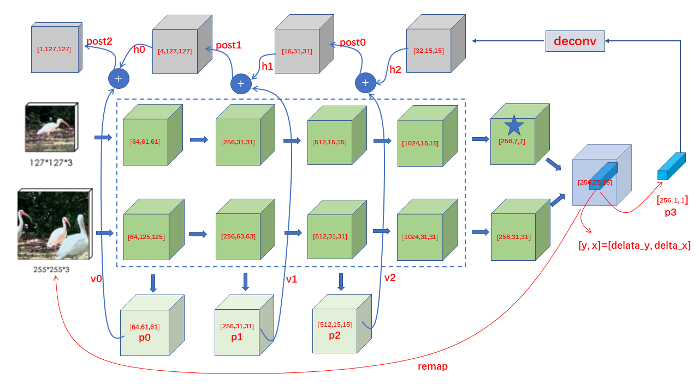

# Pytorch implementation of SiamMask

## Description
[Official Code](https://github.com/foolwood/SiamMask)



## Experiment
My experiment results on VOT2016 and VOT2018
|      ||     VOT16-E   |         VOT16-A   |        VOT16-R |    |    VOT18-E    |       VOT18-A |        VOT18-R|
|:---------:|:-----:|:--------:| :------:    |:------:  |:------:   |:------: |:------:|:------:|
| SiamMask-box  |   | 0.414    |  0.622      |   0.224   |           |0.363  |   0.585  | 0.300  |
|  SiamMask     |   |  0.433   |   0.639     |   0.205   |          | 0.380   |  0.610   |0.281 |   
| SiamMask-LD  |    | 0.456    |   0.622     |    0.244  |          | 0.421     | 0.598  | 0.234|

## Reference
```
[1] Wang Q, Zhang L, Bertinetto L, et al. Fast online object tracking and segmentation: A unifying approach. Proceedings of the IEEE conference on computer vision and pattern recognition. 2019: 1328-1338.

[2] https://github.com/foolwood/SiamMask

```
