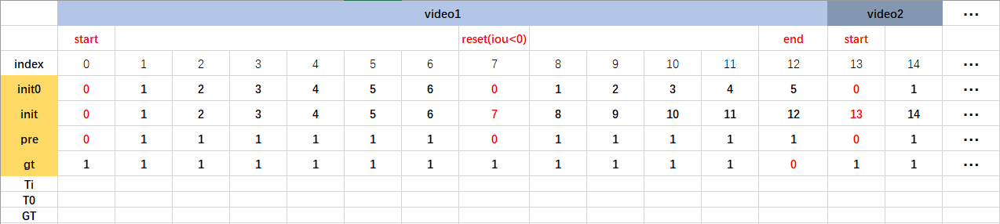

# Pytorch implementation of UpdateNet

## Description
 
- [BiliBili](https://www.bilibili.com/video/bv1Jg4y1B7tL)

- [Code](https://github.com/HonglinChu/UpdateNet)

- Note: About create_template.py at line:138  'get_axis_aligned_rect' not exist， please comment get_axis_aigned_rect function

```

    if reset:   #reset=1 (default)            

        #gt_rect = get_axis_aligned_rect(ground_truth[frame])#x，y，w，h

        rect=ground_truth[frame] #topx,topy,w,h

        gt_rect=np.array([rect[0]-1,rect[1]-1,rect[2],rect[3]])#0-based x,y,w,h

        iou = overlap_ratio(gt_rect, res)

        if iou<=0:# you can choose iou<0.2, iou<0.3,  iou<0.4

            break   
``` 

## File tree
```
├── bin
├── dasiamrpn
├── data
├── datasets
├── models
├── results
├── toolkit
└── updatenet
```

## Dataset

```
How to produce templates ? You can choose iou<0.2, iou<0.3,  iou<0.4

python ./updatenet/create_template.py
```



## Model

[SiamRPNBIG.model](https://pan.baidu.com/s/10v3d3G7BYSRBanIgaL73_Q) password: b3b6

[BaiduYun](https://pan.baidu.com/s/15mwwxY8LLKCWu2UAnMWDFg) password: 1iii

## Train
```
# step=1,2,3

python ./updatenet/train_upd.py 
```

## Test
```
python ./bin/my_test.py
```

## Experiment


- My result VOT2018 EAO=0.403, original result VOT2018 EAO=0.393 

- How to train UpdateNet on VOT2018 ?

- Stage 1.1
```
Generate templates by linear update, train from scratch

you can try learning rate Lr5-6 ,  Lr6-7, Lr7-8

checpoint1   EAO  xxx

...

checkpoint50 EAO  xxx

```
- Stage 1.2
```
Load pretrained model(the best checkpoint from stage 1.1), train from checkpoint

you can try learning rate Lr7-8 ,  Lr8-9, Lr9-10

checpoint1   EAO  xxx

...

checkpoint50 EAO  xxx
```

- Stage 2.1
```
Generate templates by UpdateNet model (choose best checkpoint from stage 1.2) , train from scratch

you can try learning rate Lr5-6 ,  Lr6-7, Lr7-8

checpoint1   EAO  xxx

...

checkpoint50 EAO  xxx
```

- Stage 2.2
```
Load pretrained model(choose best checkpoint from stage 2.1),train from checkpoint

you can try learning rate Lr7-8 ,  Lr8-9, Lr9-10

checpoint1   EAO  xxx

...

checkpoint50 EAO  xxx

```

- Stage 3.1
```
Generate templates by UpdateNet model (choose best checkpoint from stage 2.2) , train from scratch

you can try learning rate Lr5-6 ,  Lr6-7, Lr7-8

checpoint1   EAO  xxx

...

checkpoint50 EAO  xxx
```

- Stage 3.2
```
Load pretrained model(choose best checkpoint from stage 3.1), train from checkpoint

you can try learning rate Lr7-8 ,  Lr8-9, Lr9-10

checpoint1   EAO  xxx

...

checkpoint50 EAO  xxx

```

- My results

```
step1.1  lr6-7
--------------------------------------------------------------
| Tracker Name | Accuracy | Robustness | Lost Number |  EAO  |
--------------------------------------------------------------
| checkpoint30 |  0.582  |   0.286    |    61.0      | 0.367 | 
--------------------------------------------------------------

step1.2 lr9-10（load checkpoint30 model from step1.1）
--------------------------------------------------------------
| Tracker Name | Accuracy | Robustness | Lost Number  |  EAO |
--------------------------------------------------------------
| checkpoint30 |  0.585   |   0.272    |    58.0      | 0.373| 
--------------------------------------------------------------

step2.1 lr5-6 （load checkpoint30 model from step1.2）
--------------------------------------------------------------
| Tracker Name | Accuracy | Robustness | Lost Number |  EAO  |
--------------------------------------------------------------
| checkpoint36 |  0.586   |   0.295    |    63.0     | 0.366 |
--------------------------------------------------------------

step2.2 lr8-9 （load checkpoint36 model from step2.1）
--------------------------------------------------------------
| Tracker Name | Accuracy | Robustness | Lost Number |  EAO  |
--------------------------------------------------------------
| checkpoint29 |  0.584   |   0.258    |    55.0     | 0.386 |
--------------------------------------------------------------

step3.1 lr6-7 (load checkpoint29 model from step2.2)
--------------------------------------------------------------
| Tracker Name | Accuracy | Robustness | Lost Number |  EAO  |
--------------------------------------------------------------
| checkpoint22 |  0.583   |   0.253    |    54.0     | 0.390 |
--------------------------------------------------------------

step3.2 lr8-9 (load checkpoint22 model from step3.1)
--------------------------------------------------------------
| Tracker Name | Accuracy | Robustness | Lost Number |  EAO  |
--------------------------------------------------------------
| checkpoint13 |  0.583   |   0.225    |    48.0     | 0.403 |
--------------------------------------------------------------

```

## Contributor

```
Honglin Chu

Zeyu Xi
```
## Reference
```
[1] Zhang L, Gonzalez-Garcia A, Weijer J, et al. Learning the Model Update for Siamese Trackers. Proceedings of the IEEE International Conference on Computer Vision. 2019: 4010-4019.

[2] https://github.com/zhanglichao/updatenet
```

